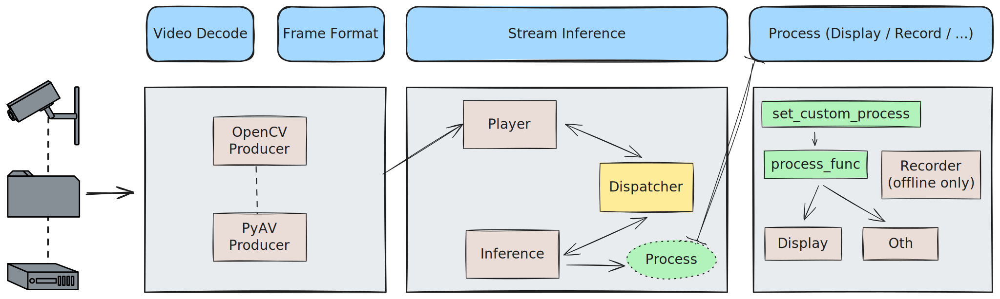

# Stream Infer

<p align="left">
   <strong>English</strong> | <a href="./README.zh.md">简体中文</a>
</p>

Stream Infer is a Python library designed for stream inference in video processing applications. It contains modular components for video frame generation, inference algorithms, and result export.

## Installation

```bash
pip install stream-infer
```

## Quick Start

Here is a simple example of Stream Infer to help you get started.

This example uses an open-source vertical detection model from [ModelScope](https://modelscope.cn/models/damo/cv_tinynas_head-detection_damoyolo/summary) for head detection.

```python
from stream_infer import Inference, FrameTracker, TrackerManager, Player
from stream_infer.algo import BaseAlgo
from stream_infer.collector import BaseCollector
from stream_infer.producer import PyAVProducer, OpenCVProducer
from stream_infer.log import logger

import time
import cv2

from modelscope.pipelines import pipeline
from modelscope.utils.constant import Tasks


class HeadDetectionAlgo(BaseAlgo):
    def init(self):
        self.model_id = "damo/cv_tinynas_head-detection_damoyolo"
        self.head_detection = pipeline(
            Tasks.domain_specific_object_detection, model=self.model_id
        )

    def run(self, frames):
        logger.debug(f"{self.name} starts inferring {len(frames)} frames")
        result = self.head_detection(frames[0])
        logger.debug(f"{self.name} inference completed: {result}")
        return result


class Collector(BaseCollector):
    def get(self, name):
        if self.results.get(name):
            return self.results[name]
        return None

    def get_last(self, name):
        algo_results = self.get(name)
        if algo_results is not None and len(algo_results.keys()) > 0:
            return algo_results[max(algo_results.keys())]
        return None


INFER_FRAME_WIDTH = 1920
INFER_FRAME_HEIGHT = 1080
OFFLINE = True

video = "/path/to/your/video.mp4"
fps = 30

# producer = PyAVProducer(INFER_FRAME_WIDTH, INFER_FRAME_HEIGHT)
producer = OpenCVProducer(INFER_FRAME_WIDTH, INFER_FRAME_HEIGHT)
collector = Collector()

if __name__ == "__main__":
    max_size = 300
    frame_tracker = (
        FrameTracker(max_size) if OFFLINE else TrackerManager().create(max_size)
    )

    inference = Inference(frame_tracker, collector)
    inference.load_algo(HeadDetectionAlgo(), frame_count=1, frame_step=fps, interval=1)

    player = Player(producer, frame_tracker, video)
    if OFFLINE:
        for frame, current_frame in player.play(fps):
            inference.auto_run_specific_inference(player.fps, current_frame)
            data = collector.get_last("HeadDetectionAlgo")
            if data is None:
                continue

            if data is not None:
                # draw results
                for box, label in zip(data["boxes"], data["labels"]):
                    start_point = (int(box[0]), int(box[1]))
                    end_point = (int(box[2]), int(box[3]))
                    color = (255, 0, 0)
                    thickness = 2
                    cv2.rectangle(frame, start_point, end_point, color, thickness)

                    font = cv2.FONT_HERSHEY_SIMPLEX
                    org = (start_point[0], start_point[1] - 10)
                    font_scale = 0.5
                    font_color = (0, 255, 0)
                    line_type = 2
                    cv2.putText(frame, label, org, font, font_scale, font_color, line_type)
            cv2.namedWindow("Inference", cv2.WINDOW_NORMAL)
            cv2.imshow(f"Inference", frame)
            cv2.waitKey(1)
    else:
        player.play_realtime(fps)
        while player.is_active():
            inference.run_inference()

    cv2.destroyAllWindows()
```

## Features and Concepts

### Real-Time Inference


Real-time inference refers to inputting a video or stream, which is played at normal real-time speed, adding frames to the frame track. The playback process is independent of the inference process. Since inference always takes some time, it causes varying degrees of result delay but does not create memory leaks or accumulation.

Real-time inference is more commonly applied to streaming media analysis such as RTMP/RTSP/HLS:

- Various live broadcast scenarios
- Real-time monitoring
- Real-time conferences
- Clinical surgeries
- ...

### Offline Inference

**Good Processing Performance**


**Poor Processing Performance**


Offline inference means inputting a video (streams are not applicable here) and performing inference in parallel with frame fetching at the speed the current computer can handle. Depending on the machine's performance, the total process time may be longer or shorter than the video duration.

Offline inference is applied to **all non-real-time necessary situations** for video structured analysis, such as:

- Post-meeting video analysis
- Surgical video replay
- ...

**Also, since offline inference's video reading and algorithm inference run in series, it can be used to test algorithm performance and effects (as shown in Quick Start, using cv2 to display post-inference video and algorithm data), while real-time inference is not suitable for the algorithm development stage.**

## Modules



### Step1. BaseAlgo

We simply encapsulate all algorithms into classes with `init()` and `run()` functions, which is BaseAlgo.

Even though Stream Infer provides a framework about stream inference, the actual algorithms still need to be written by yourself, and after writing, inherit the BaseAlgo class for unified encapsulation and calling.

For example, if you have completed a head detection algorithm and the inference call method is:

```python
# https://modelscope.cn/models/damo/cv_tinynas_head-detection_damoyolo/summary
from modelscope.pipelines import pipeline
from modelscope.utils.constant import Tasks

model_id = 'damo/cv_tinynas_head-detection_damoyolo'
input_location = 'https://modelscope.oss-cn-beijing.aliyuncs.com/test/images/image_detection.jpg'

head_detection = pipeline(Tasks.domain_specific_object_detection, model=model_id)
result = head_detection(input_location)
print("result is : ", result)
```

Then, to stream infer this algorithm in videos and streaming media, encapsulate it like this:

```python
from stream_infer.algo import BaseAlgo

class HeadDetectionAlgo(BaseAlgo):
    def init(self):
        self.model_id = 'damo/cv_tinynas_head-detection_damoyolo'
        self.head_detection = pipeline(Tasks.domain_specific_object_detection, model=model_id)

    def run(self, frames):
        return self.head_detection(frames)
```

This way, you have completed the encapsulation and will be able to call it normally in the future.

### Step2. Collector

Collector is used to collect inference results, easily collecting data such as algorithm names, results, and times.

Currently, only BaseCollector is implemented in Collector. More such as RedisCollector, TDEngineCollector, MySQLCollector, etc., will soon be developed.

Here is the simple source code for BaseCollector and an implementation called PrintCollector:

```python
class BaseCollector:
    def __init__(self):
        self.results = {}

    def collect(self, inference_result):
        if inference_result is not None:
            time = inference_result[0]
            name = inference_result[1]
            data = inference_result[2]
            self.results[name][time] = data

    def get(self, *args, **kwargs):
        raise NotImplementedError

    def aggregate(self):
        raise NotImplementedError

    def clear(self):
        self.results.clear()


class PrintCollector(BaseCollector):
    def get(self, name):
        if self.results.get(name):
            return self.results[name]
        return None

    def get_all(self):
        return self.results
```

You can get the results of a specific algorithm name using `collector.get(algo_instance.name)` or print all inference results using `collector.get_all()`. Without rewriting the `collect()` method, the format of `get_all()` return is roughly as follows:

```json
{
  "HeadDetectionAlgo": {
    "1": { "scores": [], "boxes": [] },
    "2": { "scores": [], "boxes": [] }
  },
  "other": {
    "60": { "a": 1 },
    "120": { "a": 2 }
  }
}
```

### Step3. Producer

Producer loads videos or streaming media in different ways, such as PyAV, OpenCV, ImageIO (only for offline), etc., and adjusts or converts frames' width, height, color space, etc., finally returning each frame as a numpy array.

Instantiating a Producer often requires inputting the frame width and height required for inference and the color order. The default color order is the same as the BGR order returned by `cv2.imread()`.

```python
from stream_infer.producer import PyAVProducer

producer = PyAVProducer(1920, 1080)
```

### Step4. FrameTracker

FrameTracker can be understood as a frame track, supporting caching the most recent frames into a queue, with a configurable queue `max_size` (default is 120 frames).

At the same time, FrameTracker also takes on the responsibility of obtaining the current playback time based on fps and the current frame.

It should be noted that real-time and offline are two different operating modes. In real-time operation, the producer and inference are not in the same process and belong to a multi-process environment. Both producer and inference need to access the same FrameTracker object. Therefore, when you need to run stream inference in real-time, you need to create a FrameTracker object through TrackerManager, rather than instantiating it directly through FrameTracker.

```python
from stream_infer import FrameTracker, TrackerManager

# In an offline environment
frame_tracker = FrameTracker()

# In a real-time environment
frame_tracker = TrackerManager().create(max_size=150)
```

### Step5. Inference

Inference is the core of this framework, implementing functions such as loading algorithms and running inference.

An Inference object requires a FrameTracker object (for fetching frames) and a Collector object (for collecting).

```python
from stream_infer import Inference

inference = Inference(frame_tracker, collector)
```

When you need to load an algorithm, here is an example using the one from Step1:

```python
from anywhere_algo import HeadDetectionAlgo, AnyOtherAlgo

...

inference = Inference(frame_tracker, collector)
inference.load_algo(HeadDetectionAlgo("head"), frame_count=1, frame_step=fps, interval=1)
inference.load_algo(AnyOtherAlgo("other"), 5, 6, 60)
```

Among them, we can specify a name for HeadDetectionAlgo to identify the running algorithm name (needed when Collector collects and to avoid duplication), and pay attention to the parameters:

- frame_count: The number of frames the algorithm needs to obtain, which is the number of frames finally received in the run() function.
- frame_step: Indicates that 1 frame is taken every `frame_step`, with a total of `frame_count` frames taken. If this parameter is filled with fps, it means taking the last `frame_count` frames every second.
- interval: The frequency of algorithm calls, like the above `AnyOtherAlgo`, which will only be called once a minute.

### Step6. Player & run

Player inputs producer, frame_tracker, and video/stream media address for playback and inference.

A Player requires the above parameters.

```python
from stream_infer import Player
player = Player(producer, frame_tracker, video)
```

Having loaded the algorithm, and with a collector, frame track, and player, you can start running inference.

#### Real-Time Operation

```python
player.play_realtime(fps)
while player.is_active():
    print(player.get_current_time_str())
    self.run_inference()
    print(collector.get_all())
    # Other action
```

#### Offline Operation

```python
for _, current_frame in player.play(fps):
    current_algo_name = self.auto_run_specific_inference(player.fps, current_frame)
    if current_algo_name:
        print(collector.get(current_algo_name))
    # Other action
    cv2.imshow('frame', frame)
    cv2.waitKey(1)

cv2.destroyAllWindows()
```

## License

Stream Infer is licensed under the [Apache License](LICENSE).
